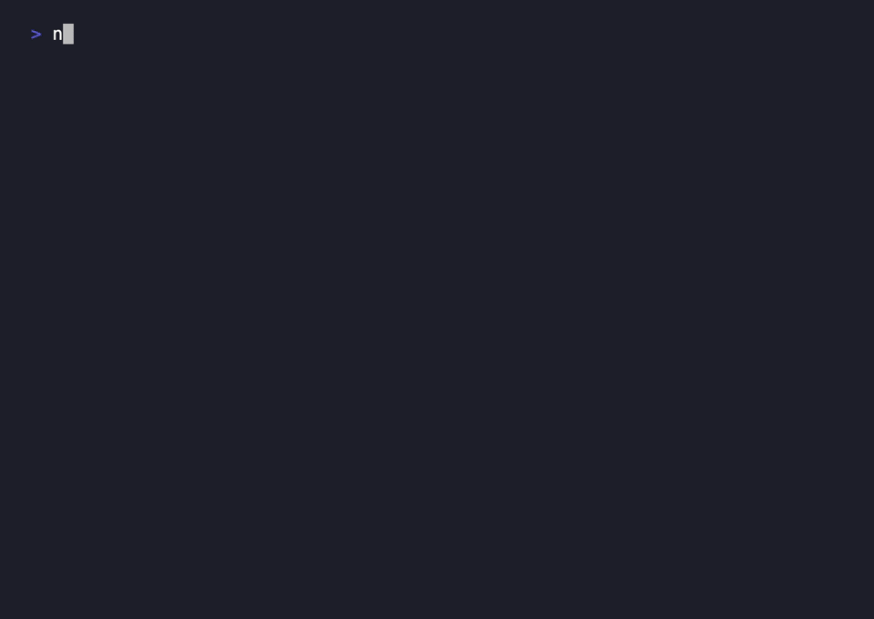

<p align="center">
  
</p>

<h1 align="center">frontfrisk</h1>

<p align="center"><b>Frisk your frontend before you ship it.</b></p>

<p align="center">
  🇺🇸 English · <a href="README.id.md">🇮🇩 Bahasa Indonesia</a> · <a href="README.zh-CN.md">🇨🇳 简体中文</a>
</p>

<p align="center">
  
  
  
  
</p>

<p align="center">
  
</p>

A skill for your coding agent (Claude Code — also Codex, Cursor, Gemini CLI,
opencode). An agent writes UI **blind** — there's no rendered page, no screen
reader, no Tab key in its hands — so the failures that only show up visually go
straight through. frontfrisk checks the markup and styles it just wrote for the
things the eyes (and the screen reader, and the keyboard) would have caught:
failing contrast, missing alt/labels, controls you can't reach by keyboard, and
color/spacing that drifted off your tokens. It fixes the mechanical ones and
won't call the UI done while a blocker is open.

(84% of homepages still fail WCAG contrast in 2026, and it's getting worse — most
of that ships from a tool that never looked.)

## Before / After

**Without frontfrisk** — the agent ships a page it never saw:

```
"Looks good, the button is done!"
```
(…2.9:1 contrast, an icon button with no label, a clickable `<div>` you can't
Tab to — none of which it can see.)

**With frontfrisk** — it checks what the eyes would catch first:

```
frontfrisk — 4 issues in the UI you couldn't see
  ✗ contrast  Button.tsx:14  #8A8A8A on #FFF = 2.9:1 (needs 4.5)  → #595959   [fixed]
  ✗ a11y      Icon.tsx:7     icon-only <button>, no label         → aria-label  [fixed]
  ✗ keyboard  Card.tsx:22    <div onClick> not focusable          → <button>   [fixed]
  ⚠ drift     Hero.tsx:30    hardcoded #3b82f6                    → var(--primary)  [fixed]
4 issues it couldn't see, now fixed.
```

"Looks good" is not a thing you can say about a page you never looked at.

## Real runs

Not a mockup. Actual frontfrisk runs in Claude Code — see **[CASES.md](CASES.md)**.

## Install

```bash
# macOS / Linux / WSL
curl -fsSL https://raw.githubusercontent.com/ryanda9910/frontfrisk/main/install.sh | bash

# Windows (PowerShell)
irm https://raw.githubusercontent.com/ryanda9910/frontfrisk/main/install.ps1 | iex
```

Finds every coding agent you have and installs the skill into each. ~10 seconds,
safe to re-run. `--project` also installs into the current repo's `.claude/`. No
key, no account, no dependency.

Manual: copy [`skill/SKILL.md`](skill/SKILL.md) into your agent's skills/rules dir
(Claude Code: `~/.claude/skills/frontfrisk/SKILL.md`).

## Documentation

Full docs in **[docs/](docs/)** — [usage](docs/usage.md) · [reference](docs/checklist.md) ·
[install](docs/install.md) · [customizing](docs/customizing.md) · [FAQ](docs/faq.md) ·
[real runs](CASES.md) · [contributing](CONTRIBUTING.md).

## Works in

Claude Code (native skill), plus any agent that loads a rules/skill file — Codex,
Cursor, Gemini CLI, opencode, Aider, GitHub Copilot CLI.

## License

MIT.
